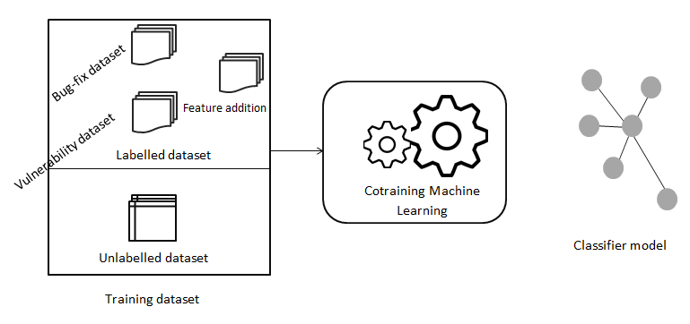

This is a machine learning project for vulnerabity patches.

* I- Introduction VulnCatcher
* II- Based Co-Training approach inside VulnCatcher
* III- Dataset used
* IV- Environnement
* V- Security patches prédiction
* VI- Results- Confusion matrix

## I-Introduction to VulnCatcher
VulnCatcher a semi-supervised learning approach for security patches detection.
 

# II Based Co-Training approach inside VulnCatcher

## III-Dataset used
This project is based on Data7 Tool(https://github.com/electricalwind/data7) for Labeled examples and each fix commits for unlabeled examples.

## IV-Environnement

Compile files with : python setup.py

<ul> <li> Download Python 2.7</li> <li> Compile files with : python setup.py </li> </ul> 

## V- Results- Confusion matrix

