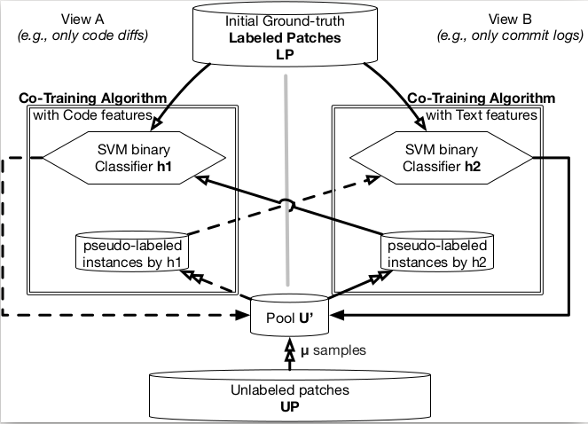
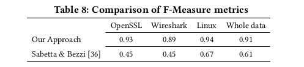
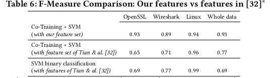

This is a machine learning project for vulnerability patches.

* I- Introduction VulnCatcher
* II- Dataset used
* III-Environment
* IV-How to run
* V- Results: Detected security patches examples
* VI- Results: Confusion matrix
* VII- State of art comparison

## I-Introduction to VulnCatcher
VulnCatcher a semi-supervised learning approach for security patches detection.

## II-Dataset collection
This project is based on Data7 Tool(https://github.com/electricalwind/data7) for Labeled examples and each fix commits for unlabeled examples.

## III-Environnement

Compile files with : python setup.py

<ul> <li> Download Python 2.7</li> <li> Compile files with : python setup.py </li> </ul> 

## IV-How to run
To run this tool, please check instructions on **setup.py**.

## V- Results: Detected security patches examples
We chose some examples on prediction set to check if our approach really detects security patches.
<ul> 
  <li> Linux project examples</li>
  <ul> 
     <li> commit 61656dd2e62f91b194b803f15c6faf0a647dcdf9</li>
     <li> commit 724519d8f987b069867cb9b0cf25a50116402f37</li> 
  </ul> 
  <li> Wireshark project examples</li> 
   <ul> 
     <li>commit 6b13c05da11e7735b4a50995c23ecf309d55a62d</li>
     <li>commit 8c959c80e983f0500b7abd4d73d0b6e845e941c0 </li> 
  </ul> 
   <li> OpenSSL project examples</li> 
   <ul> 
     <li> commit d0c98589146d79f1059638057dad9bb80d662339</li>
     <li> commit 9ee1c838cbfeb1571979198ca6891a539ae3d931</li> 
  </ul> 
</ul> 

## VI- Results- Confusion matrix

## VII- State of art comparison
##### -Our approach outperforms the state-of-the-art in the identification of security-relevant commits. 
 
 
##### -Our performance results are above those reported by prior work for classifying patches.

