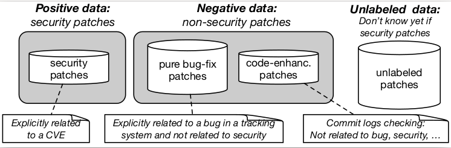
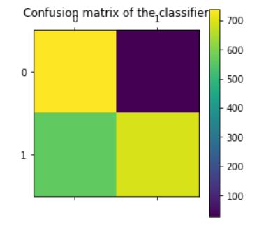

This is a machine learning project for vulnerabity patches.

* I- Introduction VulnCatcher
* II- Dataset used
* III- Environnement
* IV- Results: Detected security patches examples
* V- Results: Confusion matrix

## I-Introduction to VulnCatcher
VulnCatcher a semi-supervised learning approach for security patches detection.

## II-Dataset collection

This project is based on Data7 Tool(https://github.com/electricalwind/data7) for Labeled examples and each fix commits for unlabeled examples.<\p>

## III-Environnement

Compile files with : python setup.py

<ul> <li> Download Python 2.7</li> <li> Compile files with : python setup.py </li> </ul> 

## IV- Results: Detected security patches examples

## V- Results- Confusion matrix

